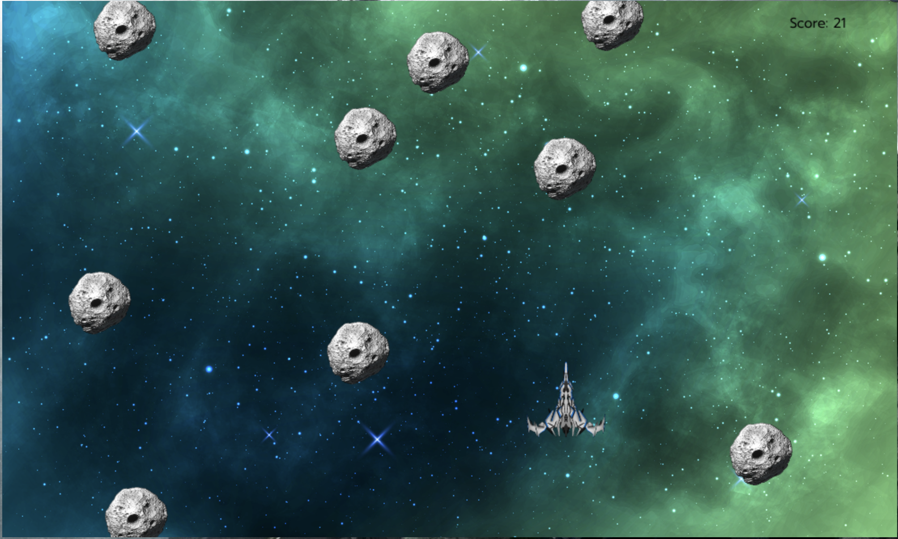

# Game name

## Description
In this game, the player gets to drive a spaceship through an asteroid rain, its main goal is to survive and score points by shooting asteroids.
The game ends when the player collides with an asteroid.

## User stories MVP

- Player can start the game by hitting the start button on main screen.
- Player can move left and right.
- Player can shoot one or more projectiles.
- Player can see the total score on the screen (top left corner).
- Player can see a game over screen when they lose.

## User stories Backlog

- User can score points by shoting asteroids, if user hits an asteroid it will get 5 points, if it misses it will lose 1 point

## File structure

- <code>assets.js</code>: contains all images and resources used in the game.
- <code>bulletController.js</code>: constructor for the bullet. Method: /_appear().
- <code>player.js</code>: constructor for the player, spaceship. Methods: /moveLeft(), /moveRight().
- <code>asteroids.js</code>: constructor for the falling asteroids. Method: ⁄_fallingAsteroid()
- <code>sound.js</code>: contains all sounds used in the game.
- <code>game.js</code>: contains all the elements for the game to work. Methods: start(), \_update()
- <code>scripts.js</code>: contains all the DOM manipulation code to start the game

## Useful links

<!-- When you finish, add these links and commit -->

- [Presentation slides](https://slides.com/paumesonero/minimal-b79be8)
- [Deployed game](file:///Users/paumesonero/Desktop/ironGame/template/ih-project1-template/index.html)
